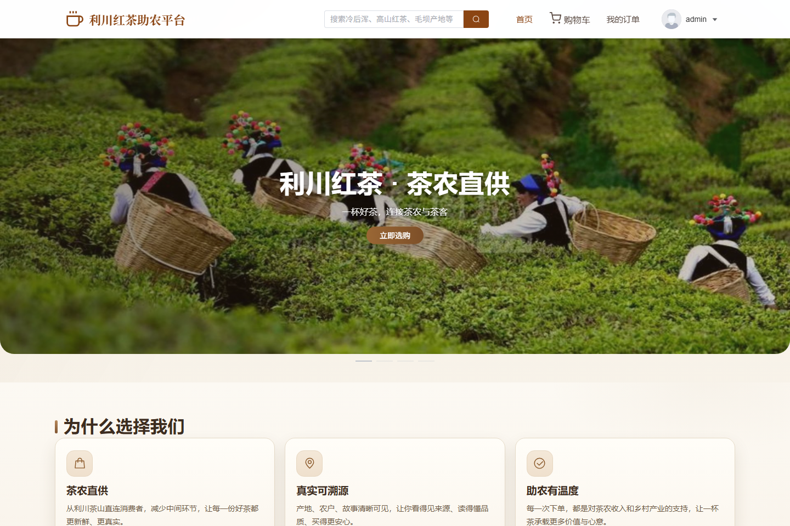
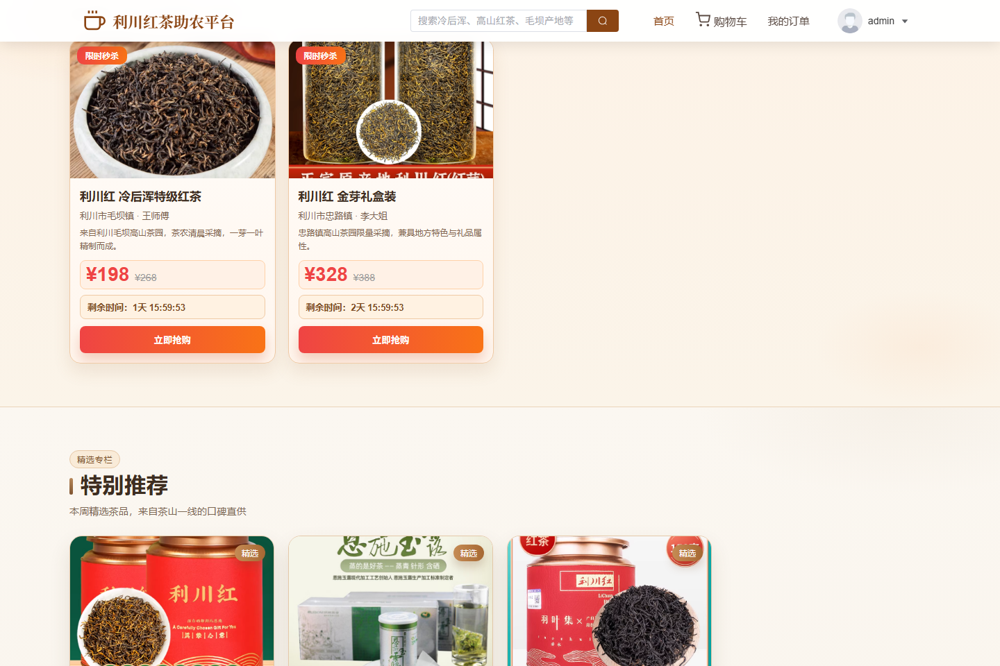
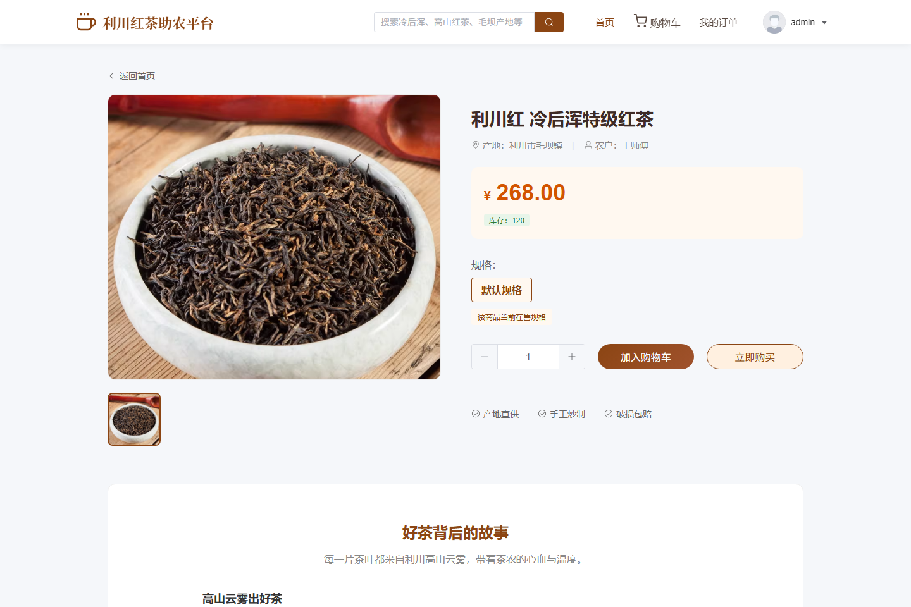
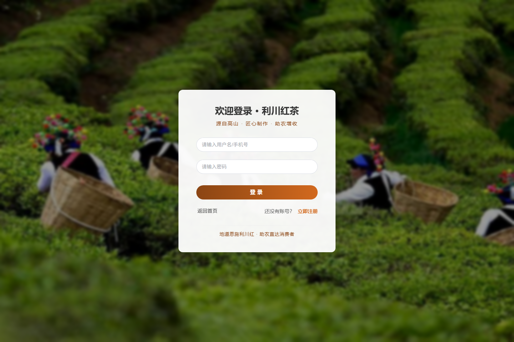
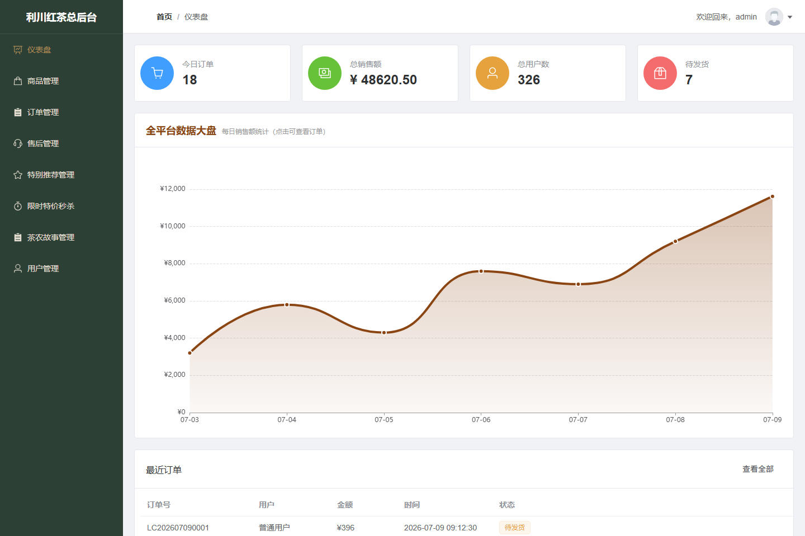
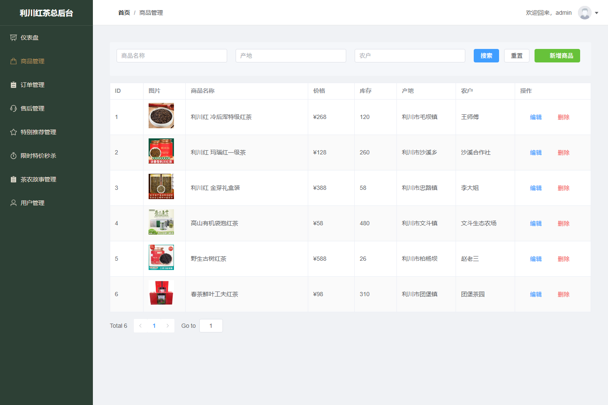
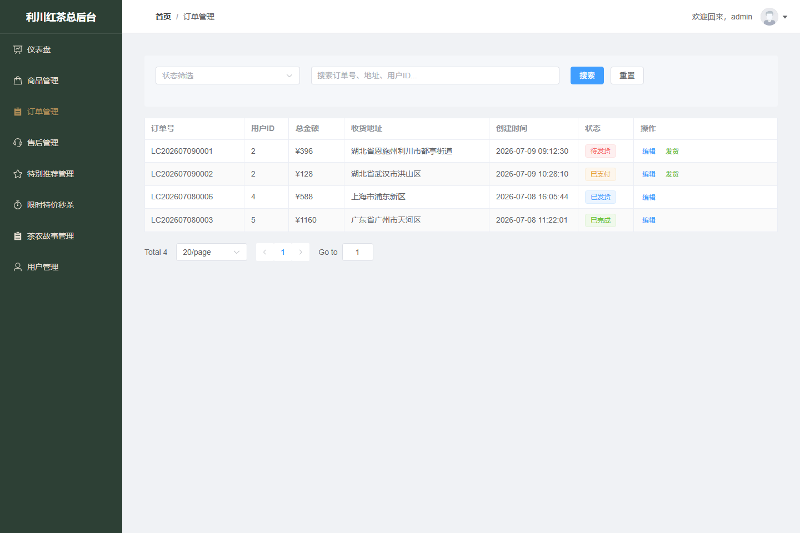
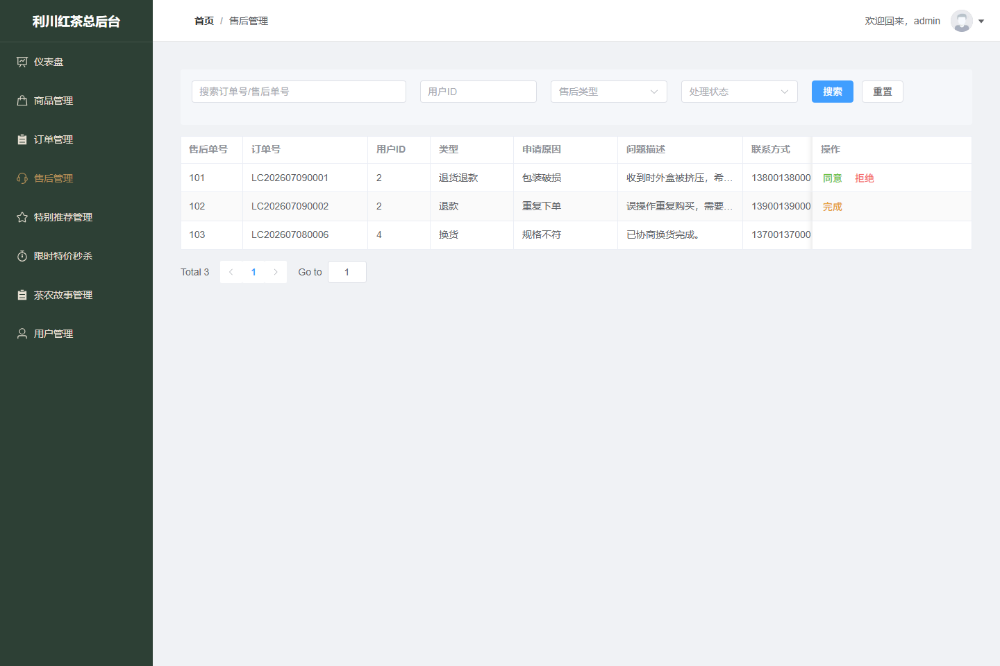
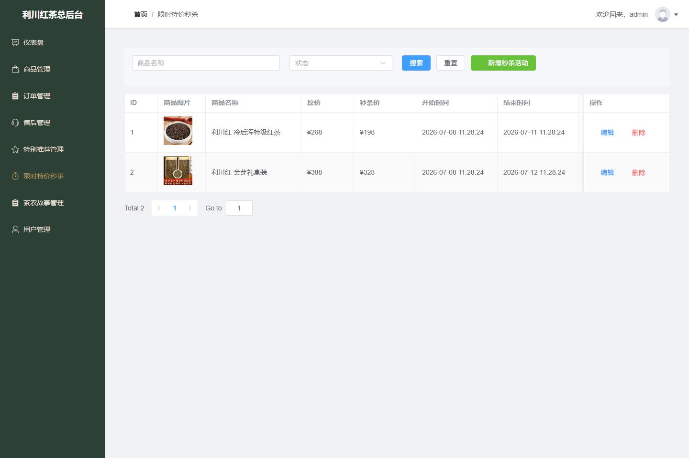
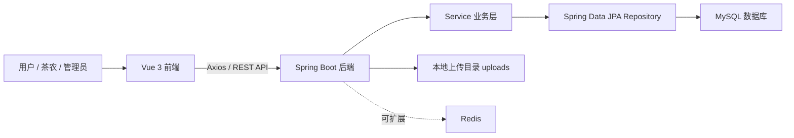

# 利川红茶电商系统



一个基于 `Spring Boot 2.7 + Vue 3` 的前后端分离电商系统，围绕湖北利川红茶的线上展示、交易、订单履约、售后管理和茶农故事运营搭建。项目既包含普通用户的商城购买链路，也包含管理员后台的商品、订单、用户、营销内容管理，适合作为毕业设计、课程设计或全栈项目展示。

[](#技术栈)
[](#技术栈)
[](#技术栈)
[](#技术栈)
[](#环境要求)

## 项目截图

以下截图来自项目真实页面，展示数据为演示数据，适合公开仓库首页快速了解系统效果。

### 商城首页

首页聚合茶园品牌首屏、价值卖点、限时秒杀、特别推荐、全部茶品和茶农故事，突出“利川红茶 + 助农直供”的项目主题。




### 商品详情

商品详情页展示商品图片、价格、库存、产地、茶农信息、规格选择、加入购物车和立即购买入口。



### 登录认证

登录页使用茶园背景图，支持普通用户、茶农和管理员登录，根据角色进入不同页面。



### 管理后台

后台提供数据看板、商品管理、订单管理、售后处理、特别推荐、限时秒杀、茶农故事和用户管理等功能。











## 项目亮点

- 完整商城流程：商品浏览、搜索、详情、购物车、下单、模拟支付、订单查看。
- 多角色后台：支持 `USER`、`FARMER`、`ADMIN` 三类角色，后台菜单与数据按角色区分。
- 运营内容管理：支持限时秒杀、特别推荐、茶农故事等内容的后台维护和前台展示。
- 售后业务闭环：用户可提交售后申请，后台可审核、处理并更新状态。
- 文件上传能力：商品图片、茶农故事图片支持上传、访问和缺图修复脚本。
- 可演示数据：后端启动后自动补齐默认账号、样例商品和茶农故事，方便快速展示。

## 功能总览

### 前台商城

- 首页：轮播图、限时秒杀、特别推荐、全部茶品、茶农故事。
- 商品列表与搜索：支持关键词搜索、分页展示和商品详情查看。
- 商品详情：展示价格、库存、产地、茶农、故事文案，可加入购物车或立即购买。
- 购物车：支持添加商品、修改数量、删除商品、清空购物车和提交订单。
- 我的订单：支持查看订单、模拟支付、申请售后和查看售后进度。
- 用户认证：支持登录、注册和基于角色的页面跳转。

### 后台管理

- 数据看板：展示用户、商品、订单、销售额等核心统计信息。
- 商品管理：支持分页查询、新增、编辑、删除、图片上传和库存维护。
- 订单管理：管理员可查看全部订单，茶农可查看包含自己商品的订单并发货。
- 售后管理：支持退款、退货退款、换货等申请的审核与状态流转。
- 营销管理：支持特别推荐和限时秒杀活动配置。
- 茶农故事管理：支持故事内容、图片、排序和启用状态维护。
- 用户管理：支持用户分页、新增、编辑、删除和角色维护。

## 技术栈

| 层级 | 技术 |
| --- | --- |
| 前端 | Vue 3、Vite 5、Element Plus、Pinia、Vue Router、Axios、ECharts、Sass |
| 后端 | Spring Boot 2.7.18、Spring Web、Spring Data JPA、Lombok |
| 数据库 | MySQL 8 |
| 缓存/扩展 | Redis 配置已接入，当前业务保留扩展空间 |
| 构建工具 | Maven、npm |

## 架构概览



## 目录结构

```text
.
├── backend
│   ├── src/main/java/com/lichuan/tea
│   │   ├── controller      # REST 接口
│   │   ├── service         # 业务逻辑
│   │   ├── repository      # JPA 数据访问
│   │   ├── entity          # 数据实体
│   │   ├── dto             # 请求/响应对象
│   │   ├── config          # 跨域、Redis 等配置
│   │   └── common          # 统一响应结构
│   ├── src/main/resources  # application 配置
│   ├── scripts             # 启动与图片修复脚本
│   └── uploads             # 商品图、茶农故事图
├── frontend
│   ├── public/images       # 前端静态图片资源
│   └── src
│       ├── api             # Axios 请求封装
│       ├── components      # 公共组件
│       ├── router          # 前端路由
│       ├── stores          # Pinia 状态
│       └── views           # 页面视图
├── init.sql                # 数据库初始化脚本
└── README.md
```

## 环境要求

- JDK 11+
- Maven 3.8+
- Node.js 18+
- MySQL 8+
- Redis 可选，当前主要业务不依赖 Redis 缓存

默认开发数据库配置位于 `backend/src/main/resources/application-dev.yml`：

```yaml
spring:
  datasource:
    url: jdbc:mysql://localhost:3306/lichuan_tea_db
    username: root
    password: 123456
```

## 快速启动

### 1. 克隆项目

```bash
git clone https://github.com/qiqiqi-max/Lichuan-Black-Tea-E-commerce-System.git
cd Lichuan-Black-Tea-E-commerce-System
```

### 2. 准备数据库

先在 MySQL 中创建数据库：

```sql
CREATE DATABASE IF NOT EXISTS lichuan_tea_db
  DEFAULT CHARACTER SET utf8mb4
  COLLATE utf8mb4_unicode_ci;
```

项目使用 JPA `ddl-auto: update`，启动后会自动创建/更新表结构。也可以按需参考 `init.sql` 初始化基础数据。

### 3. 启动后端

推荐使用项目脚本：

```powershell
cd backend
powershell -ExecutionPolicy Bypass -File .\scripts\start-dev.ps1 -KillPortOwner
```

也可以直接使用 Maven：

```bash
cd backend
mvn spring-boot:run "-Dspring-boot.run.arguments=--spring.profiles.active=dev"
```

后端默认地址：

```text
http://localhost:8080
```

### 4. 启动前端

```bash
cd frontend
npm install
npm run dev
```

前端默认地址：

```text
http://localhost:5173
```

## 默认账号

系统启动时会自动补齐以下演示账号：

| 角色 | 用户名 | 密码 | 用途 |
| --- | --- | --- | --- |
| 管理员 | `admin` | `123456` | 访问后台全部管理功能 |
| 普通用户 | `user` | `123456` | 浏览商品、下单、申请售后 |
| 茶农 | `farmer` | `123456` | 查看相关订单并发货 |

## 核心接口

| 模块 | 接口示例 |
| --- | --- |
| 认证 | `POST /api/login`、`POST /api/register` |
| 商品 | `GET /api/products`、`GET /api/products/search`、`POST /api/products/upload-image` |
| 购物车 | `POST /api/cart/add`、`GET /api/cart`、`DELETE /api/cart/remove` |
| 订单 | `POST /api/orders`、`GET /api/orders/my`、`POST /api/orders/{id}/pay` |
| 售后 | `POST /api/after-sales`、`GET /api/after-sales/manage-page`、`PUT /api/after-sales/{id}/review` |
| 营销 | `GET /api/flash-sales/active`、`GET /api/special-recommendations/active` |
| 茶农故事 | `GET /api/farmer-stories/active`、`POST /api/farmer-stories/upload-image` |
| 后台统计 | `GET /api/admin/dashboard/stats` |
| 用户管理 | `GET /api/admin/users/page`、`POST /api/admin/users`、`PUT /api/admin/users/{id}` |

## 构建验证

后端打包：

```bash
cd backend
mvn -q -DskipTests package
```

前端构建：

```bash
cd frontend
npm run build
```

当前版本已通过后端打包和前端生产构建验证。前端构建时可能出现 Vite chunk 体积提示，不影响功能运行。

## 项目展示重点

如果你是第一次查看这个项目，可以重点看这些部分：

- `frontend/src/views/HomeView.vue`：商城首页与营销内容展示。
- `frontend/src/views/admin`：后台管理页面。
- `backend/src/main/java/com/lichuan/tea/controller`：后端接口入口。
- `backend/src/main/java/com/lichuan/tea/service`：订单、售后、商品、营销等业务逻辑。
- `backend/src/main/java/com/lichuan/tea/DataInitializer.java`：演示数据自动初始化。

## 后续可扩展方向

- 接入 Spring Security 和 JWT，替换当前演示用 `mock-token`。
- 对密码使用 BCrypt 加密存储。
- 增加单元测试、接口测试和前端 E2E 测试。
- 将上传图片迁移到对象存储，增强生产环境部署能力。
- 对后台统计增加更多经营分析指标。

## 项目说明

本项目用于学习、展示和毕业设计场景，重点展示一个完整电商系统从前台购买到后台运营管理的核心流程。生产环境使用前需要补充更严格的鉴权、密码加密、权限校验、异常处理和安全配置。
